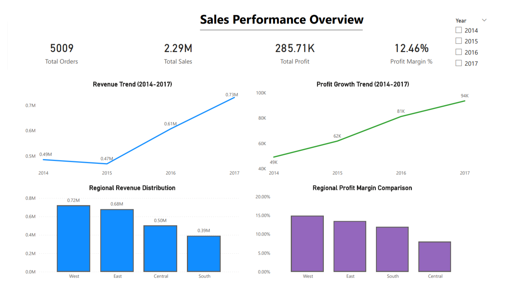
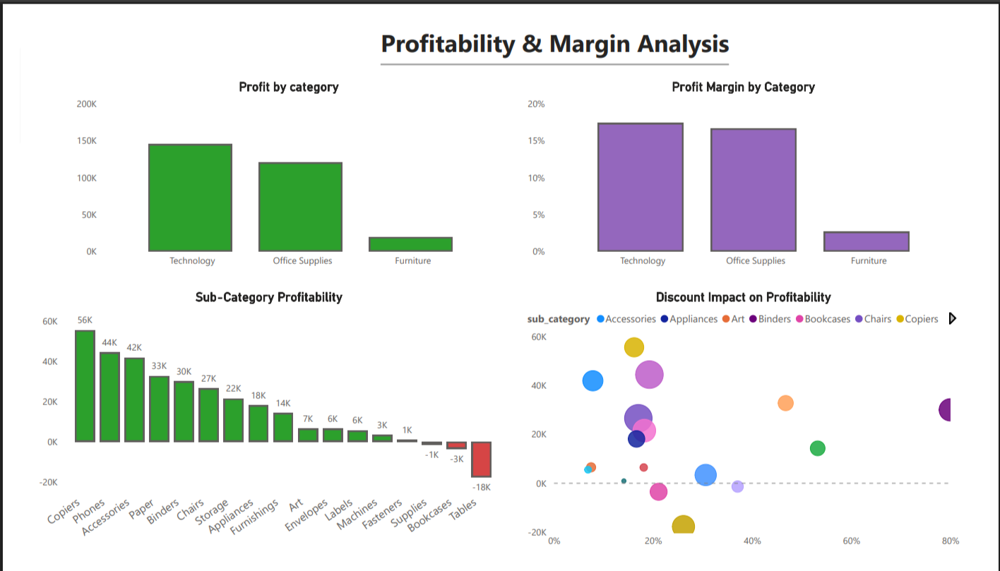

# Sales Performance Analysis (SQL + Power BI)
## 📌 Project Objective

- This project analyzes sales performance across regions, categories, sub-categories, and customers to identify profitability drivers and strategic improvement opportunities.

## 🛠 Tools Used

- MySQL (Data Cleaning & Advanced SQL Analysis)

- Power BI (Dashboarding & Visualization)

## 🔄 Project Workflow
### 1️⃣ Data Engineering

- Cleaned raw dataset in MySQL

- Corrected data types (dates, numeric fields)

- Handled null values

- Created structured analytical table

### 2️⃣ Exploratory Analysis

- Category & sub-category performance comparison

- Regional sales & profit evaluation

- KPI calculations (Sales, Profit, Orders, Margin)

### 3️⃣ Advanced SQL Analysis

- Year-over-Year Growth using LAG()

- Profit Contribution % using window functions

- Sub-category profitability segmentation

- Customer revenue concentration analysis

- Top 10 customer profit evaluation

### 4️⃣ Dashboard Development (Power BI)

- 4-page interactive dashboard

- Executive KPI overview

- Profitability deep dive

- Regional comparison

- Customer segmentation insights

- Strategic recommendations summary

### 🔍 Key Insights

- Technology is the highest revenue and margin driver.

- Furniture category shows margin instability (Tables & Bookcases loss-making).

- West region leads in both revenue and profit margin.

- Top 10 customers contribute only 6.7% of total revenue (low concentration risk).

- Highest revenue customer was negatively impacting profitability due to product mix.

### 📈 Strategic Recommendations

- Optimize discount strategy in Furniture category.

- Investigate Central region margin underperformance.

- Strengthen retention strategy for high-margin Technology customers.

- Develop cross-selling strategies within profitable sub-categories.

  ## 📊 Dashboard Preview

### Sales Performance Overview

### Profitability & Margin Analysis

## 👤 Author

Lakshay Rana  
Tools: MySQL | Power BI

